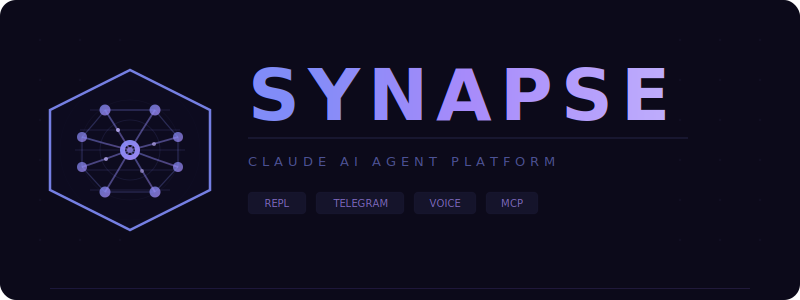

<p align="center">
  
</p>

<p align="center">
  <strong>Claude AI agent platform with REPL and Telegram bot interfaces.</strong><br/>
  Wraps the Claude Code CLI via process spawning — no SDK dependency.
</p>

<p align="center">
  
  
  
  
  
  
</p>

---

## Features

- **Dual interface**: Interactive REPL terminal + multi-chat Telegram bot
- **Session continuity**: Conversations resume across restarts via `--resume` flag
- **Concurrent agents**: Master/worker pool per chat with configurable concurrency (1–10), lazy worker init
- **Auto-team collaboration**: Master autonomously decomposes complex tasks into parallel subtasks, workers execute in parallel, results synthesized
- **Vision**: Photo and document analysis via base64 streaming
- **Voice-to-text**: Groq API (primary, <1 sec) + local whisper-cli fallback
- **Job scheduler**: Cron, interval, delay, and one-shot scheduled prompts
- **Sandbox isolation**: Each agent runs in an isolated `/tmp/neo-agent-*` directory with safety rules
- **Health monitoring**: DB, Groq, whisper, memory checks every 30s with Telegram alerts
- **Runtime config**: All agent parameters configurable live via `/config` (admin only, persisted)
- **MCP servers**: Memory, sequential thinking, filesystem, fetch, git, SQLite (currently disabled for startup speed)
- **Matrix-themed identities**: Agents get unique names (Neo, Morpheus, Trinity...) + geometric symbols (◉ ◈ ◇ △ ▽ ◎ ▣)
- **Single-message UX**: Telegram progress via `editMessageText` (no spam), responses reply to original message
- **362 tests** across 21 files with pre-commit hooks and CI pipeline

## Requirements

- [Bun](https://bun.sh) v1.0+
- [Claude Code CLI](https://docs.anthropic.com/en/docs/claude-code) installed and available in PATH

### Optional

- [Groq API key](https://console.groq.com) for cloud speech-to-text
- [whisper.cpp](https://github.com/ggerganov/whisper.cpp) + `ffmpeg` for local STT fallback
- Docker for containerized agent execution

## Quick Start

### 1. Install dependencies

```bash
bun install
```

### 2. Get your Claude Code OAuth token

Neo uses the Claude Code CLI under the hood. You need an OAuth token to authenticate:

```bash
# If you haven't installed Claude Code yet:
npm install -g @anthropic-ai/claude-code

# Generate your OAuth token:
claude setup-token
```

This will open a browser for authentication and output a token. Copy it — you'll need it in the next step.

### 3. Configure environment

```bash
cp .env.example .env
```

Edit `.env` and add your token:

```env
CLAUDE_CODE_OAUTH_TOKEN=<your-token-from-step-2>

# For Telegram bot (optional):
TELEGRAM_BOT_TOKEN=<token-from-@BotFather>
TELEGRAM_ADMIN_ID=<your-telegram-chat-id>

# For voice transcription (optional):
GROQ_API_KEY=<your-groq-api-key>
```

### 4. Run

```bash
# Interactive REPL
bun run index.ts

# Telegram bot
bun run run.ts
```

## Configuration

### Environment Variables

See [`.env.example`](.env.example) for the full list with defaults. Key variables:

| Variable                      | Required  | Default                  | Description                               |
| ----------------------------- | --------- | ------------------------ | ----------------------------------------- |
| `CLAUDE_CODE_OAUTH_TOKEN`     | Yes       | —                        | OAuth token for Claude CLI                |
| `TELEGRAM_BOT_TOKEN`          | Yes (bot) | —                        | Telegram bot token from @BotFather        |
| `TELEGRAM_ADMIN_ID`           | No        | —                        | Admin chat ID for `/config` and `/prompt` |
| `GROQ_API_KEY`                | No        | —                        | Groq API key for cloud STT                |
| `CLAUDE_AGENT_MAX_CONCURRENT` | No        | `1`                      | Concurrent agents per chat (1–10)         |
| `CLAUDE_AGENT_TIMEOUT_MS`     | No        | `0` (disabled)           | Max response time in ms (0–600000)        |
| `CLAUDE_AGENT_DB_PATH`        | No        | `~/.claude-agent/neo.db` | SQLite database path                      |
| `WHISPER_MODEL_PATH`          | No        | —                        | Path to whisper.cpp GGML model            |

### Runtime Config (Admin Only)

Modify agent parameters at runtime via Telegram — changes are validated, persisted in SQLite, and applied immediately:

```
/config                        # Show all settings
/config system_prompt <text>   # Set system prompt
/config timeout_ms 30000       # Set timeout
/config max_concurrent 3       # Set concurrency
/config log_level DEBUG        # Set log level
/config reset                  # Restore all defaults
```

| Key                | Type    | Default               | Range                 |
| ------------------ | ------- | --------------------- | --------------------- |
| `system_prompt`    | string  | `""`                  | —                     |
| `timeout_ms`       | number  | `0`                   | 0 or 5000–600000      |
| `max_retries`      | number  | `3`                   | 0–10                  |
| `retry_delay_ms`   | number  | `1000`                | 100–30000             |
| `skip_permissions` | boolean | `true`                | —                     |
| `log_level`        | string  | `INFO`                | DEBUG/INFO/WARN/ERROR |
| `docker`           | boolean | `false`               | —                     |
| `docker_image`     | string  | `claude-agent:latest` | —                     |
| `max_concurrent`   | number  | `1`                   | 1–10                  |
| `collaboration`    | boolean | `true`                | —                     |
| `max_team_agents`  | number  | `20`                  | 2–50                  |

## Usage

### Telegram Bot Commands

| Command                     | Description                          |
| --------------------------- | ------------------------------------ |
| `/start`                    | Welcome message                      |
| `/help`                     | List all commands                    |
| `/reset`                    | Clear session and start fresh        |
| `/stats`                    | Session and global statistics        |
| `/ping`                     | Bot uptime, pool count, DB status    |
| `/export`                   | Export conversation as Markdown file |
| `/schedule <expr> <prompt>` | Create a scheduled job               |
| `/jobs`                     | List active scheduled jobs           |
| `/prompt <text>`            | Set system prompt (admin)            |
| `/config [key] [value]`     | View/modify runtime config (admin)   |

**Media support**: Send photos (with optional captions), documents, voice messages, or audio files. Edit a sent message to re-process it through Claude.

#### Schedule Expressions

```
/schedule at 09:00 Buongiorno!          # One-shot at time
/schedule every 14:30 Daily report      # Recurring daily
/schedule every 30m Check status        # Every 30 minutes
/schedule in 2h Remind me              # Delay (one-shot)
/schedule cron 0 */6 * * * Every 6h    # Raw cron expression
```

#### Voice Transcription

Send a voice message or audio file on Telegram. The bot transcribes and sends to Claude automatically.

- **Cloud (Groq)**: Set `GROQ_API_KEY` — no local binaries, <1 sec, whisper-large-v3-turbo
- **Local fallback**: Install `whisper-cpp` + `ffmpeg`, set `WHISPER_MODEL_PATH`
- Both can be configured together: Groq primary, local on errors/rate limits

### REPL Commands

| Command                  | Description              |
| ------------------------ | ------------------------ |
| `/help`                  | Show available commands  |
| `/image <path> [prompt]` | Analyze an image         |
| `/history`               | Show recent conversation |
| `/sessions`              | List saved sessions      |
| `/load <id>`             | Resume a session         |
| `/stats`                 | Session statistics       |
| `/export`                | Export conversation      |
| `/reset`                 | Start fresh conversation |
| `/quit`                  | Exit                     |

Supports multiline input via `\` continuation.

## Architecture

> Detailed Mermaid flowcharts available in [`docs/ARCHITECTURE.md`](docs/ARCHITECTURE.md)

```
Telegram / REPL
      │
      ▼
  ChatQueue ─── Semaphore (N concurrent per chat)
      │
      ▼
  AgentPool ─── Master (--resume) + N-1 Workers (fresh memory)
      │
  Agent ─── Bun.spawn("claude --print --output-format json")
      │
  ┌───┴───┐
  ▼       ▼
History  SessionStore ──► SQLite (WAL mode)
  │
  ▼
Database ◄── RuntimeConfig, Scheduler, HealthMonitor
```

### Key Design Decisions

- **CLI wrapping over SDK**: Full control over process lifecycle, timeout, streaming, and version independence
- **Master/worker pool**: Master preserves session via `--resume` (text-only, `--effort high`), workers get conversation memory injection (text-only, `--no-session-persistence`)
- **Auto-team orchestration**: Master detects complex tasks, decomposes into parallel subtasks, workers execute, master synthesizes
- **SQLite WAL**: Atomic writes, concurrent reads, crash-safe persistence
- **Semaphore-based queuing**: Per-chat FIFO concurrency control
- **Sandbox isolation**: Each agent in `/tmp/neo-agent-*` with comprehensive cross-platform safety rules
- **Dual stdout/stderr reads**: Parallel Promise.all to prevent pipe deadlock
- **LRU eviction**: Agent pools capped at 500, full cleanup on eviction

### Project Structure

```
index.ts                → REPL entry point
run.ts                  → Telegram bot entry point
src/
  agent.ts              → Claude CLI wrapper (spawn, retry, timeout, vision, streaming)
  agent-pool.ts         → Per-chat agent pool (master + workers + overflow)
  agent-identity.ts     → Matrix-themed identity generator (names, codes, geometric symbols)
  orchestrator.ts       → Auto-team: detect decomposition, execute workers, synthesize
  semaphore.ts          → Counting semaphore (FIFO)
  health.ts             → Health monitor (DB, Groq, whisper, memory, every 30s)
  sandbox.ts            → Sandbox creation, safety rules, spawn env caching
  memory.ts             → Conversation memory context builder
  mcp-config.ts         → MCP server configuration generator
  db-core.ts            → Database base class (schema, CRUD, migrations)
  db.ts                 → Extended DB (Telegram sessions, config, scheduled jobs)
  chat-queue.ts         → Per-chat message queue with semaphore concurrency
  config.ts             → Env-based configuration with range validation
  formatter.ts          → Markdown → Telegram HTML + smart chunking (4096 limit)
  runtime-config.ts     → Runtime config manager (validate, persist, apply)
  scheduler.ts          → Job scheduler (croner-powered, once/recurring/delay/cron)
  whisper.ts            → STT: Groq API primary + local whisper-cli fallback
  history.ts            → Session & message persistence
  repl.ts               → Interactive terminal with slash commands
  repl-commands.ts      → REPL command implementations (pure functions)
  session-store.ts      → Telegram chatId → sessionId mapping (cached + DB)
  types.ts              → All TypeScript interfaces
  logger.ts             → Pino-based structured logging to stderr
  spinner.ts            → Terminal spinner animation
  utils.ts              → Duration formatting helper
  index.ts              → Barrel re-exports
  telegram/
    handlers.ts         → Message handlers (text, photo, document, voice, edited, auto-team)
    commands.ts         → Bot commands (/start, /help, /reset, /stats, /config, etc.)
tests/                  → 362 tests across 21 files
```

### Database Schema

```sql
sessions          (session_id PK, chat_id, created_at, updated_at)
messages          (id PK, session_id FK, timestamp, prompt, response, duration_ms, input_tokens, output_tokens)
attachments       (id PK, message_id FK, media_type, file_id, data BLOB, created_at)
telegram_sessions (chat_id PK, session_id, updated_at)
runtime_config    (key PK, value, updated_at)
scheduled_jobs    (id PK, chat_id, prompt, schedule_type, cron_expr, run_at, interval_ms, created_at, last_run_at, active)
```

9 indexes for fast lookups. Stats computed via SQL aggregates. WAL mode with foreign keys and 5s busy timeout. Auto-migration for schema evolution.

## Development

```bash
bun test              # 362 tests across 21 files
bun run typecheck     # TypeScript strict check
bun run lint          # ESLint + typescript-eslint
bun run format        # Prettier auto-format
bun run format:check  # Prettier check (CI)
```

Pre-commit hooks (Husky) run typecheck + lint + format check automatically. CI via GitHub Actions on push/PR to main.

## Production

`init.sh` can configure auto-restart:

- **macOS**: launchd service at `~/Library/LaunchAgents/com.claude-agent.telegram.plist`
- **Linux**: systemd user service at `~/.config/systemd/user/claude-agent-telegram.service`

## Tech Stack

| Component     | Technology                            |
| ------------- | ------------------------------------- |
| Runtime       | Bun                                   |
| Language      | TypeScript (strict, ESNext)           |
| Database      | SQLite via bun:sqlite (WAL)           |
| Telegram      | grammy                                |
| Logging       | pino + pino-pretty                    |
| Scheduler     | croner                                |
| Voice (cloud) | Groq API (whisper-large-v3-turbo)     |
| Voice (local) | whisper.cpp + ffmpeg                  |
| Testing       | bun:test                              |
| Linting       | ESLint + typescript-eslint + Prettier |
| CI/CD         | GitHub Actions + Husky                |

## License

Private project.
