# Synapse — Architecture Flowcharts

## Table of Contents

1. [System Overview](#1-system-overview)
2. [Bot Startup Sequence](#2-bot-startup-sequence)
3. [Telegram Message Processing](#3-telegram-message-processing)
4. [Agent Lifecycle](#4-agent-lifecycle)
5. [Agent Pool Management](#5-agent-pool-management)
6. [Voice Transcription Pipeline](#6-voice-transcription-pipeline)
7. [Session & Persistence Layer](#7-session--persistence-layer)
8. [Error Handling & Retry Strategy](#8-error-handling--retry-strategy)
9. [Scheduler & Job Execution](#9-scheduler--job-execution)
10. [Health Monitoring](#10-health-monitoring)
11. [Sandbox Isolation](#11-sandbox-isolation)
12. [Runtime Configuration](#12-runtime-configuration)

---

## 1. System Overview

High-level component architecture showing all subsystems and their interactions.

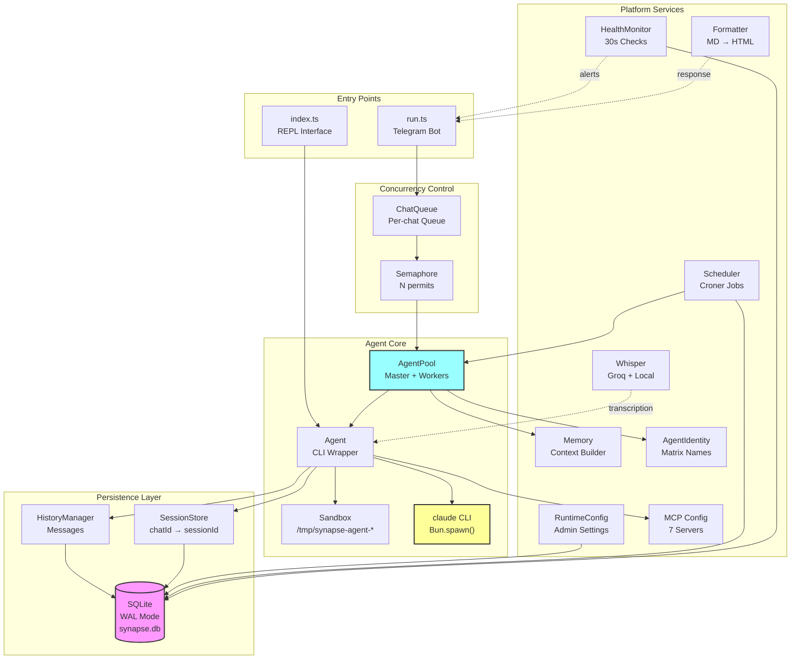

---

## 2. Bot Startup Sequence

Complete initialization flow when `run.ts` is executed.

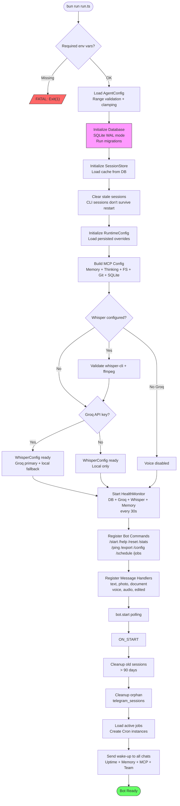

---

## 3. Telegram Message Processing

Complete flow from user message to response delivery, covering all message types.

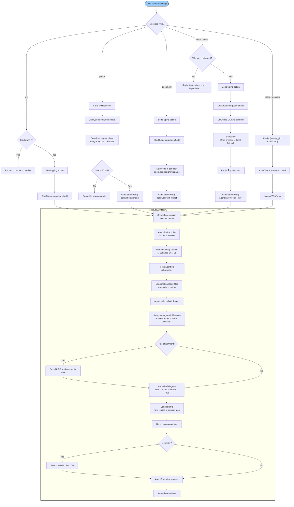

---

## 4. Agent Lifecycle

How a single Agent spawns the Claude CLI, handles I/O, parses responses, and manages timeouts.

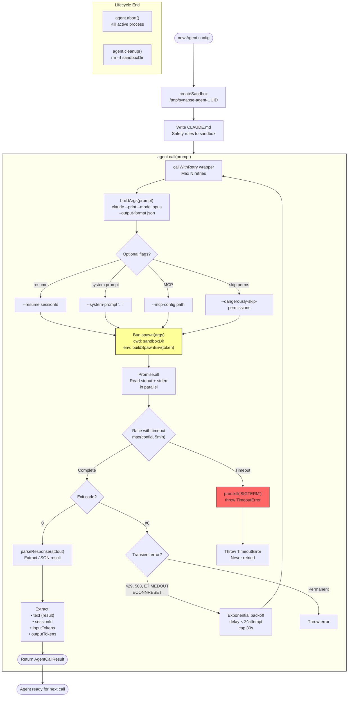

---

## 5. Agent Pool Management

Master/worker concurrency model with acquire/release semantics.

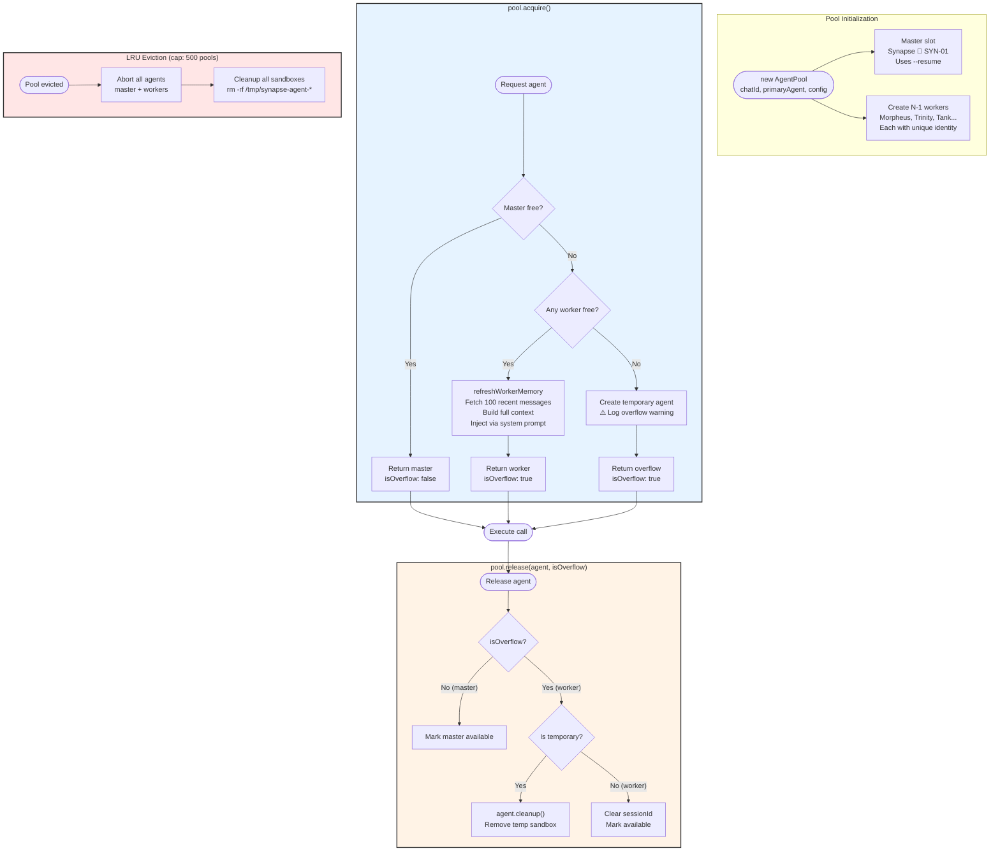

---

## 6. Voice Transcription Pipeline

Dual-path STT: Groq cloud (primary) with local whisper-cli fallback.

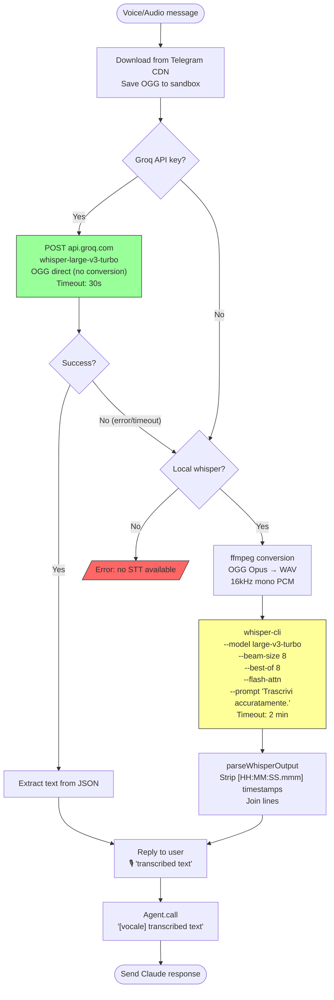

---

## 7. Session & Persistence Layer

How sessions, messages, and attachments flow through the persistence layer.

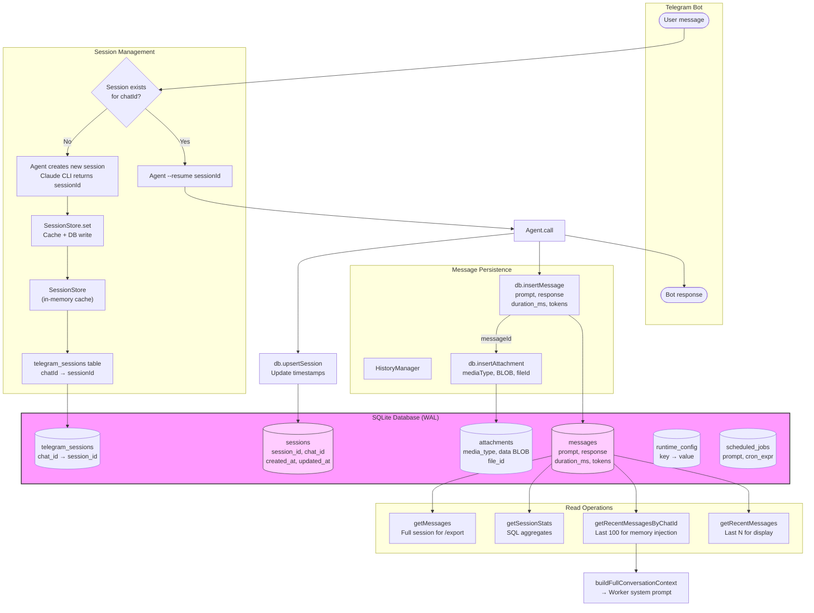

---

## 8. Error Handling & Retry Strategy

Multi-layer error handling: transient retries, session error recovery, and timeout management.

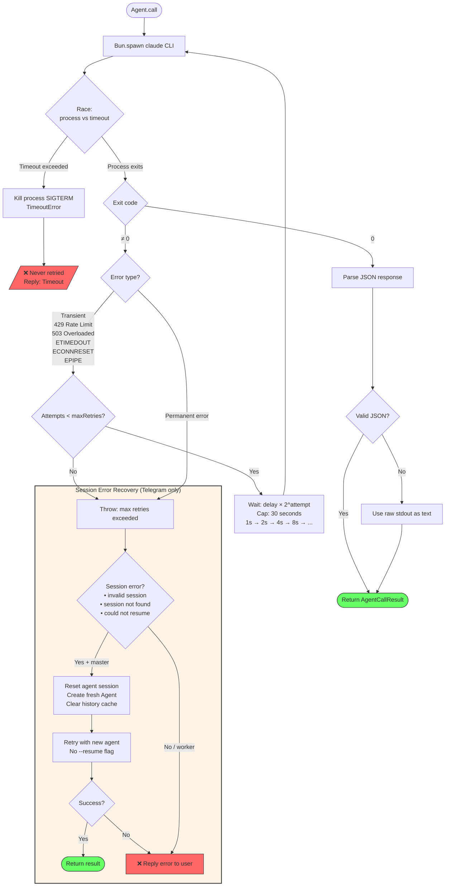

---

## 9. Scheduler & Job Execution

Job lifecycle from creation through cron scheduling to execution.

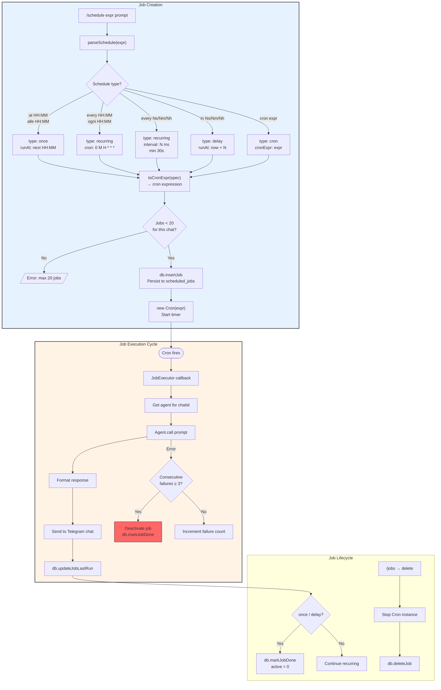

---

## 10. Health Monitoring

System health check cycle with state-change alerting.

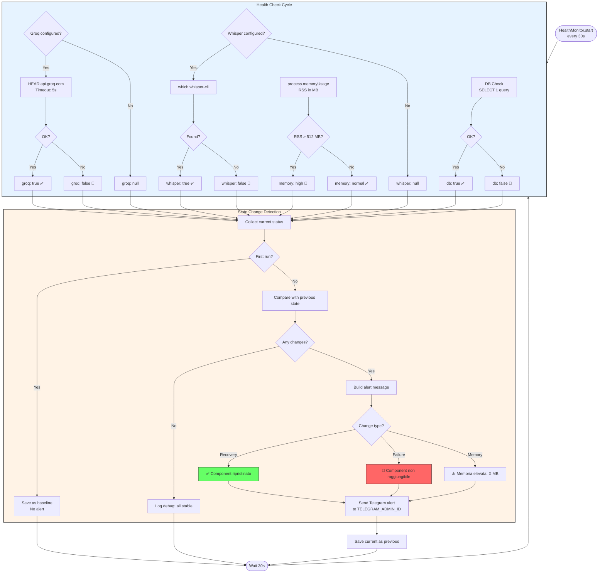

---

## 11. Sandbox Isolation

How each agent is isolated in a temporary directory with safety rules.

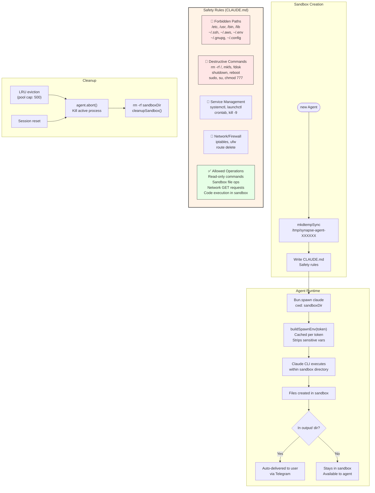

---

## 12. Runtime Configuration

Admin configuration flow: validate, persist, apply in real-time.

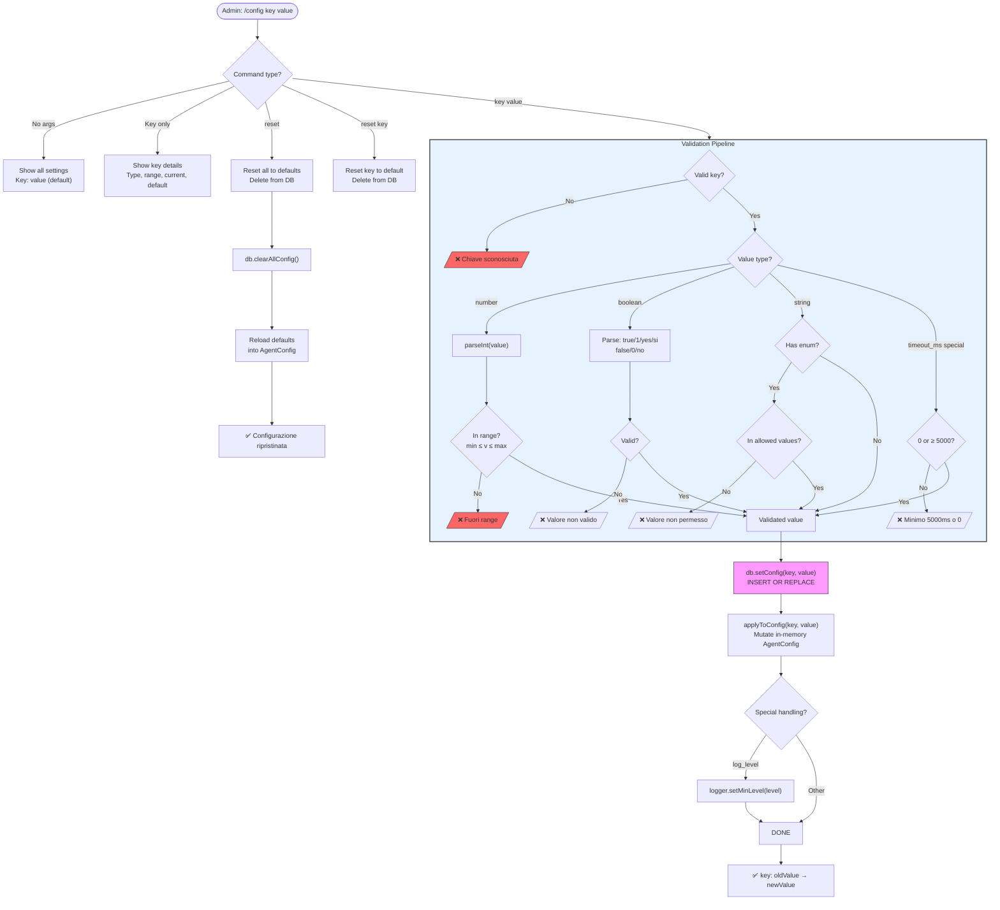
